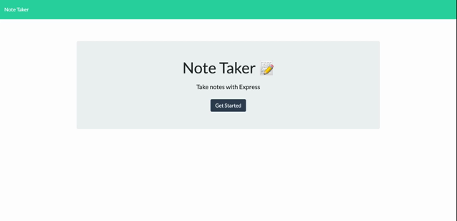

# Node JS Note Taker [](https://opensource.org/licenses/MIT)

## Description
I designed this Note Taking website for a user to create and save a list of notes. When they visit the site, they are able to add a note with a title and text body. They're able to access that note by clicking it on the left side. The user can easily delete a note by clicking on the red trash icon next to the particular note.

## Table of Contents
- [Installation](#installation)
- [Usage](#usage)
- [License](#license)
- [Contributing](#contributing)
- [Tests](#tests)
- [Questions](#questions)

## Installation

### For Note Taking Enthusiasts:

It's simple! Visit the site [here](https://fast-plateau-32420.herokuapp.com/), and start taking notes 📝       
### For Developers:
To install this application's code:
- Clone [the repo](https://github.com/sabhanson/HW11-ExpressJS-Note-Taker) from my Github to your local machine
- Open VSCode and run the following command in the built-in terminal to install the necessary node packages
``` 
npm install
```
- It will be beneficial to have nodemon package installed to run a server on your local machine. If nodemon is not already installed, run the following command in the built-in terminal.
```
npm install -g nodemon
```
- Then, run the command below to start the nodemon server.
``` 
nodemon server.js
```
- Now the server should be live at `http://localhost:3001`
- Congrats, you have successfully installed this application  ✅


## Usage

Visit the [deployed site](https://fast-plateau-32420.herokuapp.com). Click the `+` button to add a new note. Click the 💾 icon to save the note. Click the 🗑️ icon to delete a specific note. Be mindful, deleted notes cannot be recovered! 

  

## License
<p>
MIT License

  Copyright &copy; 2022 
  
  Permission is hereby granted, free of charge, to any person obtaining a copy
  of this software and associated documentation files (the "Software"), to deal
  in the Software without restriction, including without limitation the rights
  to use, copy, modify, merge, publish, distribute, sublicense, and/or sell
  copies of the Software, and to permit persons to whom the Software is
  furnished to do so, subject to the following conditions:
  
  The above copyright notice and this permission notice shall be included in all
  copies or substantial portions of the Software.
  
  THE SOFTWARE IS PROVIDED "AS IS", WITHOUT WARRANTY OF ANY KIND, EXPRESS OR
  IMPLIED, INCLUDING BUT NOT LIMITED TO THE WARRANTIES OF MERCHANTABILITY,
  FITNESS FOR A PARTICULAR PURPOSE AND NONINFRINGEMENT. IN NO EVENT SHALL THE
  AUTHORS OR COPYRIGHT HOLDERS BE LIABLE FOR ANY CLAIM, DAMAGES OR OTHER
  LIABILITY, WHETHER IN AN ACTION OF CONTRACT, TORT OR OTHERWISE, ARISING FROM,
  OUT OF OR IN CONNECTION WITH THE SOFTWARE OR THE USE OR OTHER DEALINGS IN THE
  SOFTWARE.

  </p>

## Contributing
To contribute, please contact me via [Github](https://www.github.com/sabhanson) or 
[email](mailto:sabhanson7@gmail.com).

## Tests
Testing was all self-done in the terminal and console. 

## Questions
Contact me via 
[Github ](https://www.github.com/sabhanson) or [email](mailto:sabhanson7@gmail.com)
